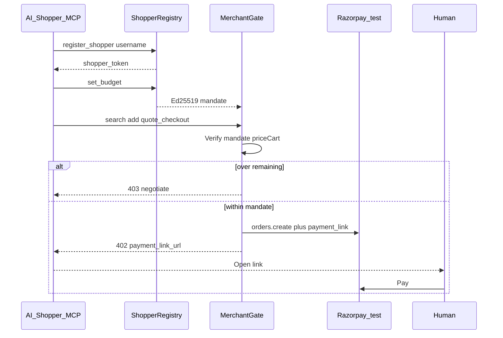

# Architecture

## What this is

**Circuit** is a mandate-gated **agentic checkout** on Razorpay **test mode**.  
**u402** is the thin adapter shape: HTTP 402 quote + signed spend mandate + Razorpay Orders.

It is **protocol-shaped** (stable catalog / mandate / quote / audit contracts a third party could implement). It is **not** a finished open protocol for every website on the internet, and not a second-agent marketplace.

Track 01 bar: one buyer agent, money actions **explainable / bounded / gated**, visible **audit**, one **failure** handled gracefully.

**Security posture:** gates live in the product path (mandate verify, server `priceCart`, no agent-held keys, 402/403, webhook HMAC, hash chain) — not a marketing checklist. A clean reference merchant: shop UI + MCP + audit + lab + growth, fail-closed throughout.

## Why u402 (India)

Other agentic payment protocols target USD/crypto settlement or require non-Razorpay APIs. NPCI UAP is not live. Indian merchants settle on Razorpay. u402 adapts: signed mandate → gate → Razorpay test Order → human confirms the card (PCI).

## Layers

1. **Shopper identity** — unique username + `shopper_token` (`/api/shoppers`, MCP `register_shopper` / `login_shopper`). Carts and mandates bind to the shopper.
2. **Budget before shop** — `set_budget` / Ed25519 mandate required before cart or checkout (`BUDGET_REQUIRED`).
3. **Catalog** — agent-readable JSON (`GET /api/catalog`). Search allowed after register.
4. **Buyer signing authority** — Ed25519 private key in `mandate-signer`. Merchant verifies with public key only.
5. **Merchant gate** — prices cart from catalog; LLM never chooses Order amount. 403 + negotiate on exceed.
6. **MCP transport** — `/api/mcp` + `npm run mcp:stdio`. Same handlers as HTTP — never a second money path.
7. **u402 quote** — 402 + Razorpay Order + **Payment Link** for headless agents; Checkout.js for UI.
8. **Audit** — hash-chained append-only log (`prevHash`/`hash`, `verifyAuditChain`).
9. **Discovery** — `/.well-known/agent-commerce.json` documents register → budget → shop for any Razorpay-builder merchant shape.
10. **Gate lab** — `/lab` adversarial demos (sessionId path; shopper UI uses tokens).
11. **Document store** — `runtime.json` (or `DATA_DIR` on Azure) holds the whole merchant runtime as **one JSON document**. That is deliberate: the schema is already MongoDB-shaped (shoppers / carts / mandates / audit / campaigns). Wiring `saveDb` → `collection.replaceOne` is an afternoon, not a different architecture. Buildathon focus stayed on the rail (signed budget, MCP, server-priced 402), not reinventing persistence.

## Stable surfaces (adapter contract)

| Surface | Shape |
| --- | --- |
| Catalog | `GET /api/catalog` products with `sku`, `pricePaise`, categories |
| Mandate | Claims + `alg` / `kid` / Ed25519 `signature` |
| Quote | `U402Quote` 402 `payment_required` or 403 blocked errors |
| Audit | Events with `explainable`, `bounded`, `gated`, `reason` |

**Third-party merchant would:** verify buyer public key → price locally → create Razorpay Order → return the same quote shape.  
**Third-party buyer would:** hold the private key → issue mandate → call catalog/checkout APIs.  
**This repo still couples:** Circuit UI + one Razorpay MID + in-process signer route (demo packaging).

## Money rules

- Mandate verify + audit before any Order create.
- Idempotent checkout ids. Failed checkout cannot be retried (stop rule).
- Decline / dismiss / expired: cart handling as documented; no retry storm.
- Remaining spend re-signed by buyer authority after capture.

## Failure demos

1. Razorpay test decline → `payment.failed` → stop rule.
2. Human closes Checkout → `checkout.dismissed`.
3. Expired mandate → `MANDATE_EXPIRED` (Gate lab).
4. Forged remaining / bad webhook → verify fail (Gate lab).

## Growth proof

`/audit` prefers **live** checkout rows (with vs without accepted upsell). Seeded baskets remain as synthetic baseline until the first live capture.

## Every shopping website?

No. Ubiquity means merchants (or a PSP/UAP rail) adopt the adapter — not one frontend scraping the open web. See TRACK01_VERIFICATION.md.
