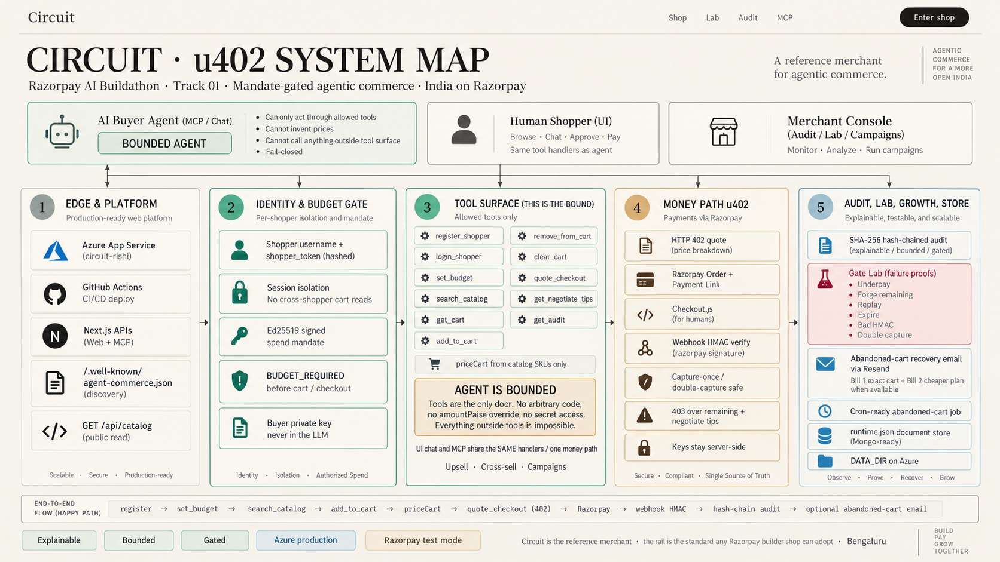
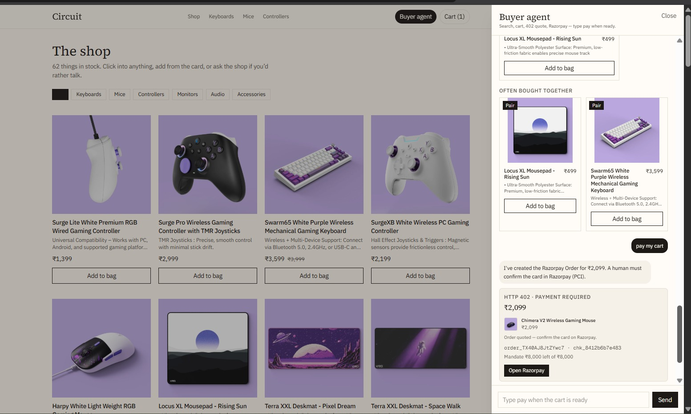
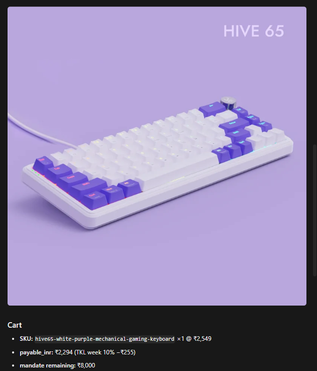
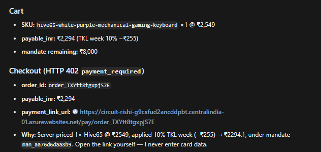

# Circuit · u402

**Razorpay AI Buildathon · Track 01 — AI Growth & Agentic Commerce**

Circuit is the **reference merchant**. **u402** is the thin adapter shape underneath it: signed spend mandate → server-priced cart → HTTP **402** quote → Razorpay Order / Payment Link → human pays.

The point is not “another chatbot.” It is a **rail any Razorpay builder merchant can adopt** so AI buyers can transact safely — explainable, bounded, and gated.




**Shop UI.** Circuit’s storefront is a clean, product-first layout — category filters, catalog grid, cart — with a persistent **Buyer agent** drawer. The agent searches, adds, and quotes; when checkout is ready it surfaces an **HTTP 402 · payment required** card with the Razorpay Order and mandate remaining, then hands the human **Open Razorpay** for PCI-safe card confirmation. Same prices, same mandate, same gate as MCP — no second money path.

---

## Why this shape (deliberately thin)

Making a merchant **AI-transactable** does not require RAG or a custom ML stack for a catalog agents can already query by **title and SKU**.

We **deliberately did not use RAG or ML models**. At platform scale compute is real — that cost should sit **once on the platform** (search ranking, recommendations, heavier models later), not get reinvented inside every merchant app.

Merchants adopt a **small contract**:

1. Signed budget (Ed25519 mandate)
2. Server-priced cart (`priceCart` from catalog SKUs only)
3. MCP discovery + tools
4. HTTP 402 into Razorpay

**Circuit** proves that contract end to end. Same gate for **shop chat UI** and **MCP agents**.

---

## What you get

| Surface | What it is |
| --- | --- |
| `/shop` | Live store — register, set budget, conversational buyer agent, Razorpay pay |
| `/lab` | Gate lab — live attacks (underpay, forge, replay, expire, bad HMAC, double capture) |
| `/audit` | Merchant console — hash-chained trail, left carts, AOV, abandoned-cart email |
| `/campaigns` | % off campaigns by category / SKU |
| `/api/mcp` + `npm run mcp:stdio` | MCP tools for Claude Desktop / any agent |
| `/.well-known/agent-commerce.json` | Agent discovery map |

### MCP buy path (screenshots)

Agents can surface product images and cart details even in MCP mode — shoppers see what they’re buying before the pay link lands.

<p align="center">
  
  &nbsp;
  
</p>

---

## Bounded agent (the hard security idea)

The AI buyer is **bounded**. It can only act through the **allowed tool surface**. Anything outside those tools is impossible.

**Allowed tools (MCP / same server handlers):**

- `register_shopper` · `login_shopper`
- `set_budget`
- `search_catalog` · `get_cart`
- `add_to_cart` · `remove_from_cart` · `clear_cart`
- `quote_checkout`
- `get_negotiate_tips` · `get_audit` (session-scoped)

**What the agent cannot do:**

- Invent Order amounts (`amountPaise` override rejected — catalog `priceCart` wins)
- Read other shoppers’ carts (token → one session)
- See Razorpay key / secret / webhook secret (never in LLM or MCP client context)
- Spend without a signed budget (`BUDGET_REQUIRED`)
- Bypass mandate expiry / remaining / signature verify

UI chat and MCP hit the **same** cart, mandate, and checkout code paths — no soft second money door.

---

## Security & gates (fail-closed)

Gates live in the product path, not as a sticker row. Prove them on `/lab`.

| Gate | Behavior |
| --- | --- |
| Budget before cart | No `set_budget` → cart / checkout locked (UI + MCP) |
| Ed25519 mandate | Buyer authority signs max / remaining / expiry; merchant verifies **public key only** |
| Catalog prices win | Server `priceCart` from stored SKUs; LLM never chooses Razorpay amount |
| Keys server-side | Razorpay credentials + webhook HMAC secret never enter agent context |
| Over remaining → 403 | No Order created; negotiate tips returned |
| Webhook HMAC | Bad signature ignored |
| Capture once | Double capture / confirm on same Order debits once |
| Stop rule | Decline / dismiss — cart intact, no retry storm |
| Hash-chained audit | SHA-256 `prevHash` → `hash`; `/audit` shows chain OK / broken |
| Session isolation | Shopper token hashed at rest; merchants see cross-session only on `/audit` |

**Lab attacks (live `POST /api/lab`):** forge remaining · replay stale mandate · expire mandate · bad webhook HMAC · double capture · underpay injection.

---

## Email

Optional — shopping and MCP work without it.

| Flow | What happens |
| --- | --- |
| Email OTP | Shopper verifies email at gate (Resend). Enables cart reminders. |
| Abandoned-cart reminder | Merchant `/audit` → Left carts → **Send reminder email** (per session) or bulk **Send reminders now** |
| Email content | **Bill 1** = exact abandoned bag + pay link · **Bill 2** = cheaper same-category plan when one exists |
| Cron-ready | `POST /api/cron/abandoned-cart` with `Bearer CRON_SECRET` (Azure-friendly) |

Requires `RESEND_API_KEY` / `RESEND_FROM`. Asset art: `public/email-background.png` (set `EMAIL_ASSET_ORIGIN` to your public HTTPS origin so Gmail can load images).

---

## Growth features

- Conversational upsell / cross-sell in the buyer agent
- Campaigns (`/campaigns`) — percent off by category or SKU, budget-capped
- `/audit` AOV with vs without upsell
- Left-cart recovery email (above)
- Negotiate tips when quote exceeds remaining mandate

---

## Happy path

```text
register_shopper → set_budget (Ed25519)
  → search_catalog → add_to_cart
  → priceCart (server)
  → quote_checkout (HTTP 402 + Razorpay Order / Payment Link)
  → human pays on Razorpay
  → webhook HMAC → capture-once
  → hash-chain audit
  → (optional) abandoned-cart email if they leave
```

---

## Run locally

```bash
cp .env.example .env.local
# RAZORPAY_KEY_ID (rzp_test_…) + RAZORPAY_KEY_SECRET
# optional: OPENAI_API_KEY, BUYER_MANDATE_*_B64, RESEND_*, MCP_SHARED_SECRET, DATA_DIR
npm install
npm run dev
```

Open [http://localhost:3000/shop](http://localhost:3000/shop) → register → set budget → shop.

| URL | Purpose |
| --- | --- |
| `/shop` | Store + buyer agent |
| `/lab` | Gate attacks |
| `/audit` | Merchant audit + emails |
| `/campaigns` | Campaigns |
| `GET/POST /api/mcp` | MCP over HTTP |
| `/.well-known/agent-commerce.json` | Discovery |
| `GET /api/catalog` | Agent-readable catalog |

### MCP stdio (Claude Desktop / Inspector)

```bash
npm run mcp:stdio
```

```json
{
  "mcpServers": {
    "circuit-u402": {
      "command": "npx",
      "args": ["tsx", "scripts/mcp-server.ts"],
      "cwd": "/absolute/path/to/this/repo"
    }
  }
}
```

Flow: `register_shopper` → save `shopper_token` → `set_budget` → `search_catalog` → `add_to_cart` → `quote_checkout` → hand `payment_link_url` to the human.

Optional: `MCP_SHARED_SECRET` → `Authorization: Bearer …` on `/api/mcp`.

---

## Deploy

Production target: **Azure App Service** via **GitHub Actions** (not a hobby one-click host). Set `DATA_DIR` for persistent `runtime.json` on Azure. Configure Razorpay webhook URL to your public `/api/webhooks/razorpay`.

### What broke on Azure — and how we fixed it

These were **real App Service / deploy pain**, not toy bugs. Localhost was fine. GitHub had the right code. Azure still lied to us for hours.

#### 1. Stale / cached builds — Azure kept serving the *old* app

**What happened.** After green GitHub Actions runs, the live URL still showed an **old homepage and old behavior**. We’d refresh, wait, redeploy — same ghost build. Localhost and the repo were already on the new Circuit / Buildathon UI. Azure was not.

**Why it hurt.** App Service doesn’t always do a clean replace of `/home/site/wwwroot`. Early packages left stale files behind. On-server Oryx rebuilds could also interfere with a Next.js standalone bundle. So “Actions is green” did **not** mean “users see the commit you think.”

**What we did.**
- Went into the instance (Kudu) and **cleared stale site contents / cached deploy artifacts** so new files could actually land
- Stopped shipping fat / half-broken packages — build a slim Next **standalone** zip in GitHub Actions (standalone + `.next/static` + `public`)
- Set `SCM_DO_BUILD_DURING_DEPLOYMENT=false` so Azure **doesn’t rebuild on the box** and corrupt the artifact
- Hard-refresh after a truly green deploy and verify homepage text matches the commit

That’s the kind of issue you only learn by shipping: CI green ≠ production truth until the site files are actually replaced.

#### 2. 409 Conflict + restart hell — zombie deploy locks

**What happened.** GitHub Actions started failing with **`Conflict (CODE: 409)`**. The Azure Portal still said deployment **“In Progress”** even after the pipeline failed. Every re-run hit the same 409. Separately, App Settings / secrets looked updated in the portal but the running Node process still had old env until we **Restart**ed.

**Why it hurt.** A cancelled or fat OneDeploy can leave a **zombie lock** under Kudu (`/home/site/deployments/pending`, `/home/site/locks/*`). Actions fails; Kudu never clears “pending.” Hammering re-runs makes it worse. Env vars also only apply when the process starts — so “I set the secret” without a restart is a silent trap.

**What we did.**
- Kudu SSH: delete `pending` and clear `/home/site/locks/*`
- **One deploy at a time** — don’t pile Actions runs into a locked site
- Slim the zip so OneDeploy doesn’t hang forever
- After any App Settings change → **Restart** App Service so Node picks up Razorpay / mandate / Resend env for real

Full trail: [DEPLOY_AZURE.md](DEPLOY_AZURE.md) · [WHAT_BROKE.md](WHAT_BROKE.md)

---

## Persistence

One JSON document: `data/runtime.json` (`src/lib/store.ts`) — shoppers, sessions, carts, mandates, audit, campaigns, checkouts.

Same document shape is **Mongo-ready** (`replaceOne` later). Buildathon focus stayed on the **rail** (mandate + MCP + 402 + Razorpay), not swapping a file for a database.

---

## Stack

Next.js · TypeScript · Razorpay test mode · Ed25519 · `@modelcontextprotocol/sdk` · hash-chained audit · Resend (email) · Azure App Service

---

## Docs

- [ARCHITECTURE.md](ARCHITECTURE.md) — layers, contracts, money rules
- [PITCH.md](PITCH.md) — 5-minute demo script
- [TRACK01_VERIFICATION.md](TRACK01_VERIFICATION.md) — verify claims against code

---

## Track 01 bar

| Official ask | Where Circuit shows it |
| --- | --- |
| Explainable / bounded / gated money | Mandate + `priceCart` + 402/403 + tool bound |
| Audit trail | Hash-chained `/audit` |
| One failure handled gracefully | Decline / dismiss + stop rule; lab failure proofs |
| AI-transactable merchant | Shop UI + MCP + discovery + Payment Link |

**Circuit** = reference shop. **u402** = the contract. Ship the standard first; platform intelligence layers can come later.
